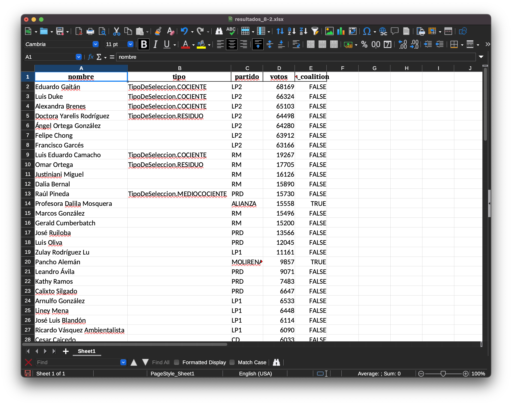

# Escrutinio

Esta es la fórmula de escrutinio que se utiliza para la seleccionar Diputados para la Asamblea Legislativa de la República de Panamá en "circuitos plurinomiales". Se puede utilizar con datos en Excel o en CSV.

Calcula correctamente todos los cocientes, medicocientes y residuos de un circuito. Además, permite la asignación de escaños a los partidos políticos.

## Instrucciones de uso

1. Instalar Jupyter Notebook y Python 3: `python3 -m venv .env`, `source .env/bin/activate` y `pip install jupyter pandas`
1. En `data/` copiar los dos escrutinios del cicuito a contabilizar. El primer escrutinio es el total por "nómina" y el segundo es el total por "candidato". Utilizar los archivos de ejemplo como referencia.
1. Modificar `escrutinio.ipynb` con el nombre de los archivos de escrutinio y el total de curules.
1. Correr el notebook con `jupyter notebook` o `Visual Studio Code`
