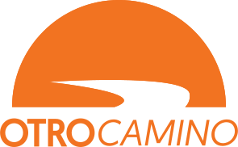

# Escrutinio

Esta es la fórmula de escrutinio que se utiliza para la seleccionar Diputados para la Asamblea Legislativa de la República de Panamá en "circuitos plurinomiales". Se puede utilizar con datos en Excel o en CSV.

Calcula correctamente todos los cocientes, medicocientes y residuos de un circuito. Además, permite la asignación de escaños a los partidos políticos.

## Instrucciones de uso

1. Instalar Jupyter Notebook y Python 3: `python3 -m venv .env`, `source .env/bin/activate` y `pip install jupyter pandas`
1. En `data/` copiar los dos escrutinios del cicuito a contabilizar. El primer escrutinio es el total por "nómina" y el segundo es el total por "candidato". Utilizar los archivos de ejemplo como referencia.
1. Modificar `escrutinio.ipynb` con el nombre de los archivos de escrutinio y el total de curules.
1. Correr el notebook con `jupyter notebook` o `Visual Studio Code`

## Limitantes

- Optimizado para leyes del 2024. Usamos resultados del 2019 para realizar la pruebas, pero el concepto de "Votos de Coalición" y "Diputados R" no existían en ese momento.
- "Diputados R" no se asignan automáticamente. Se deben asignar manualmente en las hojas de datos.
- "Diputados R" y "Votos de Coalición" son demasiado complicados.
- El ID del candidato es su nombre en la papeleta. Usábamos esto contra el TER del Tribunal Electoral, quienes utilizan el "nombre del candidato" como identificador; y se han rehusado a utilizar la cédula o algún ID individual. Ni siquiera publican los "nombres legales" de las personas. Esto puede causar problemas si dos candidatos tienen el mismo nombre.
- Bug: Si un candidato es nominado por dos coaliciones distintas, ambas con "Diputados R", el sistema puede contar esos votos extra a una coalición incorrecta. Ejemplo: Junior Herrera fue nominado en Panamá Oeste por PRD, Molinera y RM. Creo que aparece como "R" en Molirena. El sistema puede que le sume los vots a RM, cuando debería sumarle a PRD por ser coalición.

## Gracias a

Tech Squad del **Movimiento Otro Camino**. Seguimos!

